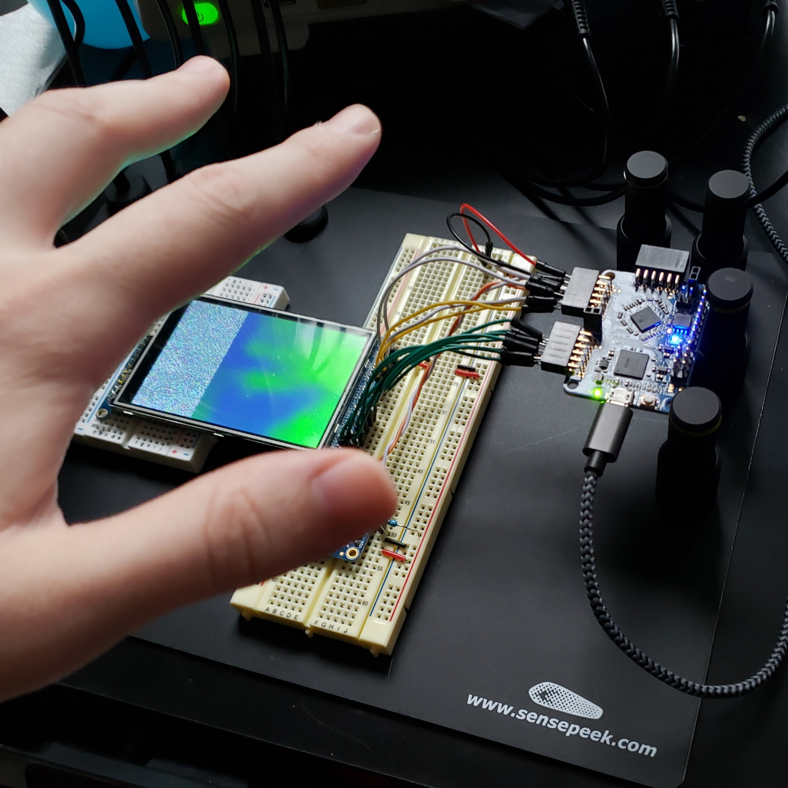

# Amg8833 Bicubic Upscaling Test

The Amg8833 thermal camera outputs at 8x8@10Hz. Low enough where upscaling starts to become quite important.
Looking around on the web, it seems that projects using it typically would do some form of bicubic scaling to 
compensate for the low resolution. Unfortunately, due to bicubic scaling being somewhat expensive, the outputs tend to
be partially scaled with bicubic, and then nearest neighbor for the rest of the way.

This project was an attempt at using an iCEBreaker FPGA for realtime bicubic scaling.

As it stands, the design can operate at 45MHz, and takes roughly 5 clock cycles per pixel.

```
Info: Device utilisation:
Info: 	         ICESTORM_LC:  1800/ 5280    34%
Info: 	        ICESTORM_RAM:     1/   30     3%
Info: 	               SB_IO:    16/   96    16%
Info: 	               SB_GB:     8/    8   100%
Info: 	        ICESTORM_PLL:     1/    1   100%
Info: 	         SB_WARMBOOT:     0/    1     0%
Info: 	        ICESTORM_DSP:     2/    8    25%
Info: 	      ICESTORM_HFOSC:     0/    1     0%
Info: 	      ICESTORM_LFOSC:     0/    1     0%
Info: 	              SB_I2C:     0/    2     0%
Info: 	              SB_SPI:     0/    2     0%
Info: 	              IO_I3C:     0/    2     0%
Info: 	         SB_LEDDA_IP:     0/    1     0%
Info: 	         SB_RGBA_DRV:     0/    1     0%
Info: 	      ICESTORM_SPRAM:     0/    4     0%
```

(Note that only part of the display will be used to maintain the source aspect ratio)
